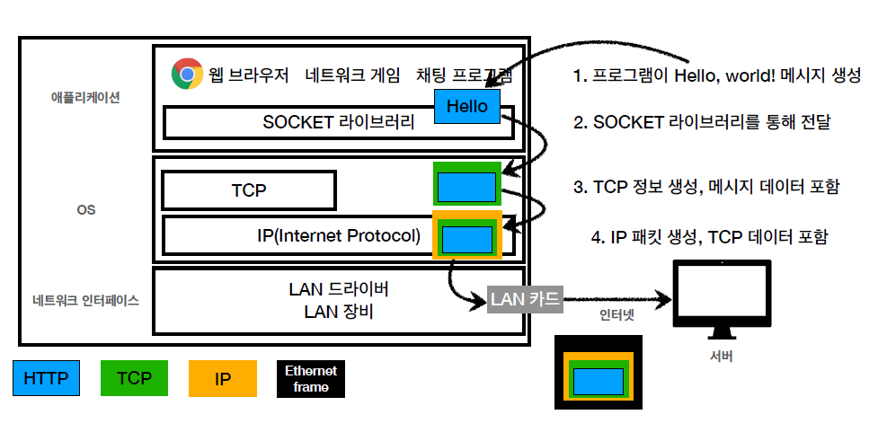

## [IP](https://github.com/tjdux/CS/blob/main/network/03%20%EB%84%A4%ED%8A%B8%EC%9B%8C%ED%81%AC%20%EA%B3%84%EC%B8%B5/01%20%EB%84%A4%ED%8A%B8%EC%9B%8C%ED%81%AC%20%EA%B3%84%EC%B8%B5.md#%EC%9D%B8%ED%84%B0%EB%84%B7-%ED%94%84%EB%A1%9C%ED%86%A0%EC%BD%9C-ip-internet-protocol)
- 네트워크 계층 
- 클라이언트와 서버는 IP 주소를 통해 서로를 식별
- IP 역할
	- 지정한 IP 주소 (IP Address)에 데이터 전달
	- 패킷 (Packet)이라는 통신 단위로 데이터 전달 
- IP 패킷 헤더: 출발지 IP + 목적지 IP + 기타 ...
- 클라이언트 ↔️ 서버 패킷 전달
  - 송신지가 인터넷 망에 패킷 전달
  - 인터넷에서 여러 노드끼리 패킷을 전달
  - 최종적으로 수신지에서 패킷을 전달 받음
- IP 프로토콜의 한계
	- 비연결성: 패킷을 받을 대상이 없거나 서비스 불능 상태여도 패킷 전송
		- 송신지에서는 수신지가 패킷을 받을 수 있는 상태인지 아닌지 모름 
	- 비신뢰성
		- 중간에 패킷이 사라지면? (패킷 유실)
		- 패킷이 순서대로 안 오면?: 단편화된 IP 패킷이 순서대로 전달되지 않는다면? 
	- 프로그램 구분: 같은 IP를 사용하는 서버에서 통신하는 애플리케이션이 둘 이상이면? 
	- ➡️ TCP가 문제점 해결
 

## [TCP, UDP](https://github.com/tjdux/CS/blob/main/network/04%20%EC%A0%84%EC%86%A1%20%EA%B3%84%EC%B8%B5/02%20TCP%20%26%20UDP.md)
- 프로토콜 계층

- 전송 계층
- TCP 세그먼트 헤더: 출발지 PORT, 목적지 PORT, 전송 제어, 순서, 검증 정보... 
- TCP 특징
	- 연결 지향 - TCP 3 way handshake (**가상 연결**)
		- 가상 연결: 실제로 연결이 된 것이 아니고 개념적으로만 연결된 것 
		- 클라이언트와 서버끼리만 논리적으로 연결이 된 것인지 확인 (중간에 수 많은 노드들이 연결되어 있는지는 모름)
    - TCP 3 way handshake
      - 1️⃣ SYN: 클라이언트 -> 서버  
      - 2️⃣ SYN + ACK: 서버 -> 클라이언트
      - 3️⃣ ACK: 클라이언트 -> 서버 (데이터도 함께 전송 가능)
      - 4️⃣ 데이터 전달
      - SYN: 접속 요청 / ACK: 요청 수락
	- 데이터 전달 보증
		- 서버에서 데이터를 받았으면 데이터를 잘 받았다고 응답함 
	- 순서 보증
		- 단편화된 패킷이 순서대로 도착하지 않았다면 (전송 제어 정보, 순서 정보) 다시 보내라고 알려줌 
	- 신뢰할 수 있는 프로토콜
	- 현재는 대부분 TCP 사용 
- UDP 특징
	- 기능이 거의 없음
	- 연결지향, 데이터 전달 보증, 순서 보증 ❌
	- 데이터 전달 및 순서가 보장되지 않지만, 단순하고 빠름 (최적화 가능)
	- 정리
		- IP와 거의 같음 (+PORT, 체크섬 정도만 추가) (체크섬: 간단한 오류 검출 기능)
		- 애플리케이션에서 추가 작업 필요 
 

## [PORT] (https://github.com/tjdux/CS/blob/main/network/04%20%EC%A0%84%EC%86%A1%20%EA%B3%84%EC%B8%B5/01%20%EC%A0%84%EC%86%A1%20%EA%B3%84%EC%B8%B5%20%EA%B0%9C%EC%9A%94_IP%20%ED%95%9C%EA%B3%84%20%26%20%ED%8F%AC%ED%8A%B8.md#%EC%9D%91%EC%9A%A9-%EA%B3%84%EC%B8%B5%EA%B3%BC%EC%9D%98-%EC%97%B0%EA%B2%B0-%EB%8B%A4%EB%A6%AC-%ED%8F%AC%ED%8A%B8)
- TCP 헤더의 출발지 PORT, 목적지 PORT
- PORT: 같은 IP 내에서 프로세스 구분 
- PORT
	- 0 ~ 65535 할당 가능
	- 0 ~ 1023: 잘 알려진 포트, 사용하지 않는 것이 좋음 
 

## DNS
- IP는 기억하기 어렵고, 변경될 수 있다 
- DNS (Domain Name System): 도메인 명을 IP 주소로 변환
- DNS 사용
	- 1️⃣ 클라이언트가 도메인명 google.com 요청
	- 2️⃣ DNS 서버에서 응답으로 그에 해당하는 IP 주소 반환
	- 3️⃣ 클라이언트가 그 IP 주소에 접속 