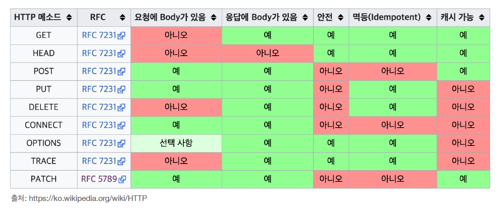

## 안전 (safe)

- 호출해도 리소스를 변경하지 않는다.
   

## 멱등 (Idempotent)

- f(f(x)) = f(x)
- 몇 번을 호출하든 결과가 동일하다.
- 멱등 메서드
  - GET: 몇 번을 조회하든 같은 결과가 조회됨
  - PUT: 결과를 대체하므로 같은 요청을 여러번 조회해도 최종 결과는 동일
    - 클라이언트가 같은 파일을 여러번 업로드 상황이라면, 결과가 동일함
  - DELETE: 같은 요청을 여러번 해도 삭제된 결과는 동일
- ⚠️ POST는 멱등이 아님! 두 번 호출하면 같은 결제가 중복해서 발생할 수 있음
- 활용
  - 자동 복구 매커니즘 (서버가 TIMEOUT 등으로 정상 응답을 못 주었을 때, 클라이언트가 멱등한 메서드를 요청했다면 같은 요청을 다시해도 됨 )
- 멱등은 외부 요인으로 중간에 리소스가 변경되는 것까지는 고려하지 않음
   

## 캐시 가능 (Cacheable)

- 응답 결과 리소스를 캐시해서 사용해도 되는가?
- 🙆‍♀️: GET, HEAD, POST, PATCH
- 실무에서는 GET, HEAD 정도만 캐시로 사용
  - POST, PATCH는 본문 내용까지 캐시 키로 고려해야 해서 구현이 쉽지 않음
